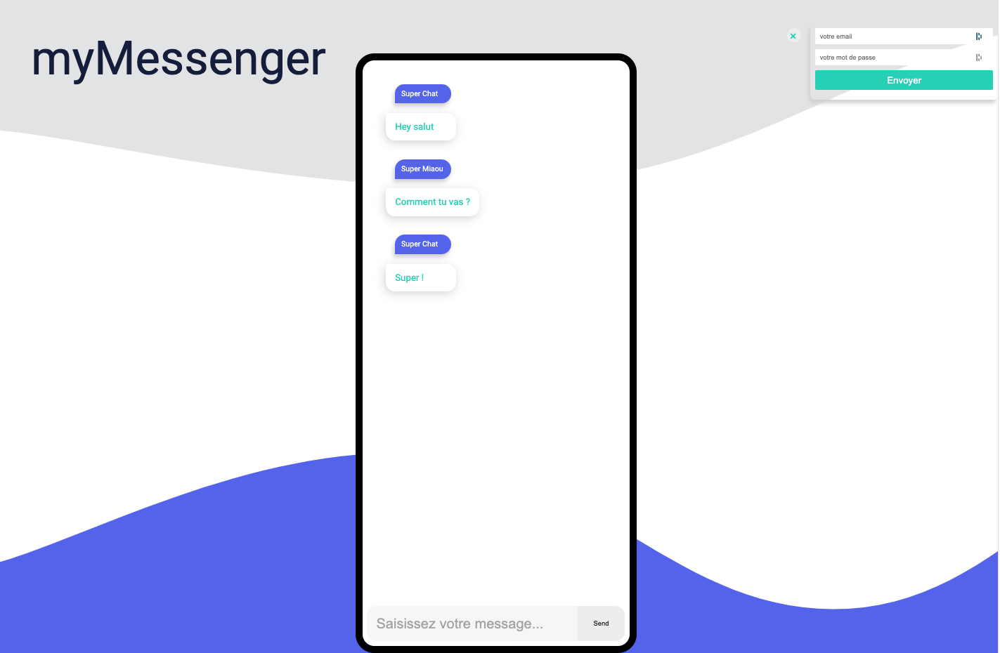

# :speech_balloon: My Messenger

## Create a chat application

## Illustration

## Languages/tools
- HTML5 / CSS3 / SCSS
- Javascript / React / Hooks / Redux
- Webpack / Babel
- PropTypes

## Goals 
- Discover React (web page usage)
- Components architecture for scalable application
- Discover Redux (store, reducer, action, containers, selectors)
- UI/UX 

## Status
Project not completed

## Context
Project carried out during my training as a web developer